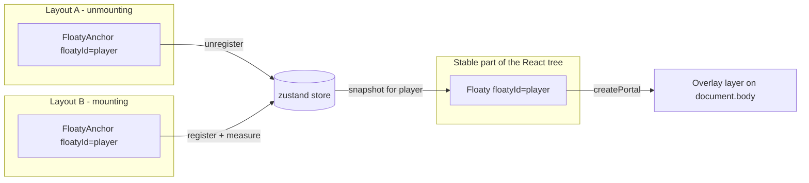
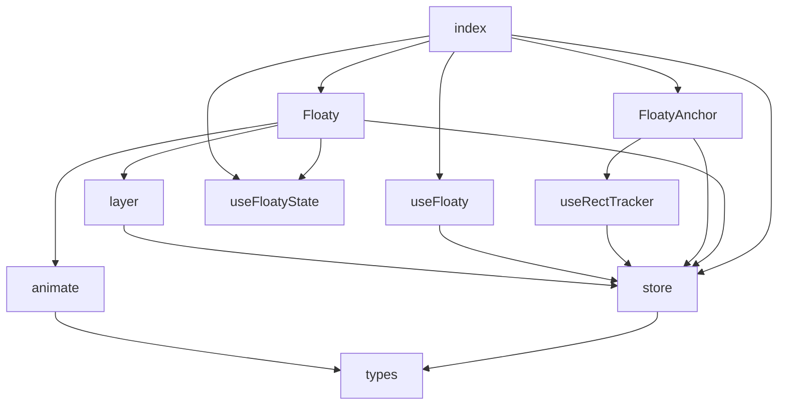
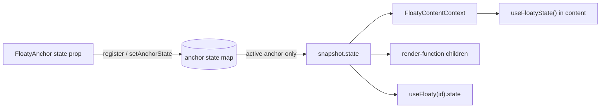
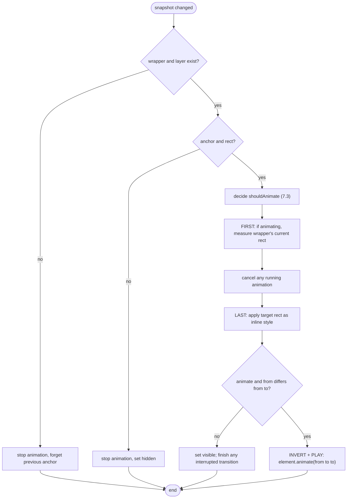
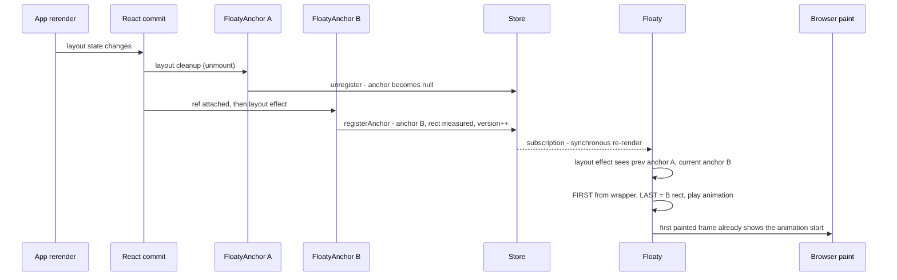

# floaty-component: Architecture

| | |
| --- | --- |
| Status | Current (v0.1.0) |
| Audience | Contributors and maintainers |
| Scope | Runtime architecture, data flow, animation model, packaging, testing, trade-offs |

For usage, see the [README](../README.md).

---

## 1. Problem statement

In React, an element's state is tied to its **position in the tree**. When an app switches
between layouts (grid to list, page to sidebar, full player to mini player), the subtree
for the old layout unmounts and the new one mounts. Anything rendered inside it, such as a
video player, a form, a map, or a WebSocket-backed widget, **loses its state and is
re-created**, and there is no visual continuity between the old and new positions.

The usual workarounds each have drawbacks:

| Workaround | Drawback |
| --- | --- |
| Lift state up / external store | Only works for serializable state; DOM state (video playback, iframes, canvas, focus, scroll) is still lost |
| Keep both layouts mounted and toggle with CSS | Doubles the render cost and duplicates the stateful component |
| Physically move DOM nodes (reparenting) | React does not support it; it breaks reconciliation and event handling |

**floaty-component** takes a different approach: the stateful content is rendered **once**,
in a stable location in the tree, into an **overlay layer** on top of the page. Layouts only
render lightweight **placeholders** (anchors). The overlay measures the active anchor and
positions the content over it, animating between anchors when the layout changes.

## 2. Goals and non-goals

**Goals**

- Keep both React state and DOM state of floating content across arbitrary layout changes.
- Visual continuity: animate (FLIP) between old and new positions, or snap on request.
- Minimal API: one component for content, one for placeholders, an optional hook.
- No provider required; works anywhere in the tree.
- Small footprint: no animation library; only `react`, `react-dom` and `zustand`.
- Respect `prefers-reduced-motion`.
- SSR-safe: no DOM access during render.

**Non-goals**

- General-purpose shared-element transitions between arbitrary elements (as in
  framer-motion's `layoutId`). Only `Floaty` content moves; anchors are static boxes.
- Clipping content to scroll containers. Floating content sits above the page and is
  not clipped by `overflow: hidden` ancestors of the anchor (see section 12).
- Animating content opacity or appearance. Only position and size are animated.

## 3. Conceptual model

Three concepts:

| Concept | Component | Responsibility |
| --- | --- | --- |
| **Content** | `<Floaty floatyId>` | Owns the stateful children; renders them once into the overlay layer |
| **Anchor** | `<FloatyAnchor floatyId>` | A plain `div` that reserves space in a layout and reports its viewport rect |
| **Channel** | `floatyId` (string) | Connects one content to any number of anchors |

For each `floatyId`, **at most one anchor is active**: the most recently mounted one.
Anchors form a stack, so when the active anchor unmounts, the previous one becomes active
again.



## 4. Module map

```text
src/
  index.ts           Public exports
  types.ts           Shared types: FloatyRect, FloatySnapshot, FloatyTransition, ...
  store.ts           zustand store: anchor stacks, snapshots, config; geometry helpers
  layer.ts           Shared overlay layer: lazy creation, ref counting, config styling
  Floaty.tsx         Content component: portal, positioning, animation decisions
  FloatyAnchor.tsx   Placeholder component: registration, active-state subscription
  useRectTracker.ts  Measurement triggers for the active anchor (resize, scroll, RO)
  useFloaty.ts       Read-only status hook (incl. anchor state) + remeasure()
  useFloatyState.ts  Content context + useFloatyState() for reading anchor state inside content
  animate.ts         FLIP animation (Web Animations API + rAF fallback), easing
  utils.ts           useIsomorphicLayoutEffect
```

Dependency direction (no cycles):



## 5. State model

### 5.1 Store shape (`src/store.ts`)

A single module-level vanilla zustand store (`createStore` from `zustand/vanilla`),
consumed from React via `useStore(floatyStore, selector)`.

```ts
interface FloatyState {
  config: FloatyConfig;                         // zIndex, transition, layerClassName
  anchors: Record<string, HTMLElement[]>;       // mounted anchors per floatyId; last = active
  snapshots: Record<string, FloatySnapshot>;    // derived, immutable per floatyId
  registerAnchor(floatyId, el, state?): () => void;  // returns unregister
  setAnchorState(floatyId, el, state): void;    // shallow-compared; mirrored only if el is active
  measure(floatyId, reason?): void;             // re-measure active anchor; no-op if unchanged
  setAnimating(floatyId, isAnimating): void;
}
```

Per-anchor `state` values live in a module-level `Map<HTMLElement, unknown>` next to the
store, not in store state. Only the **active** anchor's state is mirrored into the snapshot,
so state changes on inactive anchors never notify subscribers.

### 5.2 Snapshot

```ts
interface FloatySnapshot {
  anchor: HTMLElement | null;   // active anchor element
  rect: FloatyRect | null;      // last known viewport rect; kept after the anchor goes away
  state: unknown;               // active anchor's `state` prop; kept after the anchor goes away
  reason: 'anchor' | 'layout' | 'scroll';
  version: number;              // bumped only when anchor or rect changes
  isAnimating: boolean;
}
```

Design notes:

- **Immutable and replaced on change.** Each snapshot object is stable until something
  changes, so selectors like `state.snapshots[id] ?? EMPTY_SNAPSHOT` return referentially
  stable values and components only re-render for their own `floatyId`.
- **`version` is the positioning signal.** `Floaty`'s positioning effect depends on
  `version` and `anchor`, not on the whole snapshot. Toggling `isAnimating` does not bump
  `version`, so reporting animation status never re-triggers positioning (no feedback loop).
  The same applies to `state`: changing it re-renders content but never repositions it.
- **`rect` survives anchor removal.** It records where the content last was, which is
  useful for `useFloaty` consumers. When content is hidden and later re-anchored, it snaps
  rather than animating from a stale position.
- **`reason`** tells `Floaty` *why* the rect changed, which drives the animate-or-snap
  decision (section 7.3).

### 5.3 Store operations

| Operation | Effect |
| --- | --- |
| `registerAnchor(id, el, state)` | Records `state`, moves `el` to the top of `anchors[id]`; if the active anchor changed, measures it, copies its `state`, sets `reason: 'anchor'`, `version++` |
| unregister (returned fn) | Removes `el` and its state; if it was active, activates the next anchor (or `null`, keeping `rect` and `state`) |
| `setAnchorState(id, el, state)` | No-op if shallow-equal; otherwise records it and, if `el` is active, patches `snapshot.state` without bumping `version` |
| `measure(id, reason)` | Reads `getBoundingClientRect()` of the active anchor; updates only if the rect differs |
| `setAnimating(id, b)` | Updates `isAnimating` without bumping `version` |
| `configureFloaty(opts)` | Shallow-merges config (deep-merges `transition`) |
| `resetFloaty()` | Restores initial state (tests) |

## 6. Component internals

### 6.1 `FloatyAnchor`

1. Holds its element in a **ref** (not state), merged with any forwarded ref.
2. In a **layout effect** keyed on `floatyId`, calls `registerAnchor` with the current
   `state` (read from a ref so registration does not re-run on state changes); the cleanup
   unregisters.
3. A second layout effect keyed on `state` calls `setAnchorState`. The store compares it
   shallowly, so passing `state={{ ... }}` inline is cheap.
4. Subscribes to a boolean selector: "am I the active anchor for this id?"
5. While active, `useRectTracker` keeps the rect fresh.
6. A dependency-free layout effect calls `measure(id, 'layout')` after every render while
   active, catching moves caused by parent re-renders that don't resize the anchor.
7. Spreads remaining props onto the `div`, so a native `id`, `className`, `style`, ARIA
   attributes and so on all work.

### 6.2 `useRectTracker`

While the anchor is active, it attaches:

| Source | Reason reported |
| --- | --- |
| `ResizeObserver` on the anchor | `layout` |
| `window` `scroll` (capture phase, so nested scroll containers count) | `scroll` |
| `window` `resize` | `scroll` |

Triggers are coalesced into **one measurement per animation frame**. If both kinds of
trigger fire in the same frame, `layout` takes precedence over `scroll`, because a real
layout shift should animate even if a scroll happened in the same frame.

Only the **active** anchor installs listeners, so the cost is per `floatyId`, not per anchor.

### 6.3 `Floaty`

1. Acquires the shared layer via `useFloatyLayer()` (section 8).
2. Subscribes to its snapshot and to `config.transition`.
3. Returns `null` until the layer exists (SSR and first client render), or while there is
   no anchor and `keepMounted={false}`.
4. Otherwise portals a wrapper `div` (`position: absolute; top: 0; left: 0`) containing
   `children` into the layer.
5. A single **positioning layout effect** (section 7) runs when `version`, `anchor`,
   `layer`, `floatyId` or `keepMounted` change.

Positioning is applied **imperatively** to the wrapper (`transform`, `width`, `height`,
`visibility`, `data-floaty-state`) rather than through React's `style` prop. That keeps
high-frequency updates (scroll) out of React reconciliation, and lets the Web Animations API
own the element during transitions. React only controls the static styles; user `style`
is merged in and should avoid `transform`, `width` and `height`.

Rendering `Floaty` on scroll does not re-render `children`: the `children` element identity
is unchanged and the content context value is memoized on `state`, so React bails out of
that subtree. (Render-function children are called on every `Floaty` render; keep them
cheap or memoize inside.)

### 6.4 Anchor state flow

Anchor state lets one stateful component adapt per layout (for example, a full player in
the grid and a mini player in the sidebar) without remounting.



- `Floaty` provides `FloatyContentContext` (`{ floatyId, state }`) around its content, so any
  descendant can call `useFloatyState()`. Because context crosses portals, this works even
  though the content lives in the overlay layer.
- On an anchor switch, the new anchor's state is copied into the snapshot **in the same store
  update** that changes `anchor` (section 9). Content therefore re-renders into its new form
  in the same frame the FLIP animation starts, and the animation shows the content morphing
  as it moves.
- Because only element types and positions decide whether React keeps component state,
  content keeps its hooks and state across state changes. Effects that depend on state
  values re-run, which is the intended way to "change logic" per layout.

## 7. Positioning and animation

### 7.1 Coordinate system

- The store keeps **viewport** rects (`getBoundingClientRect()`).
- The layer is `position: fixed; inset: 0`, so its origin normally equals the viewport
  origin. `Floaty` still subtracts the layer's own rect (`relativeTo(rect, layerRect)`) so
  positioning stays correct if the layer is offset (for example, by a transformed ancestor
  or custom layer styling).
- Content is placed with `translate3d(x, y, 0)` plus explicit `width` and `height`. The
  transform keeps movement on the compositor; the size change is a layout of the content
  only, which keeps it simple and accurate (no scale distortion of text or video).

### 7.2 The positioning effect (FLIP)



Key properties:

- **Interruptible.** "First" is measured from the wrapper's *current, possibly
  mid-animation* rect (`getBoundingClientRect()` reflects running animations). A layout
  switch during a transition therefore continues smoothly from wherever the content is.
- **Final state is always in inline styles.** Animations use `fill: none`; when an
  animation ends or is cancelled, the element is already at its resting position. There is
  no "stuck mid-animation" state.
- **Lifecycle callbacks** fire once per continuous transition: `onTransitionStart` when
  movement begins from rest, `onTransitionEnd` when it finishes or is resolved by a snap.
  Retargeting mid-flight does not re-fire `onTransitionStart`.

### 7.3 Animate-or-snap decision

`shouldAnimate = transition !== false && !prefersReducedMotion() && (one of the triggers below)`

| Trigger | Condition | Duration |
| --- | --- | --- |
| Anchor switched | previous anchor was non-null and differs from the current one | `transition.duration` |
| Layout shifted | same anchor, `reason === 'layout'`, `animateLayoutChanges` | `transition.duration` |
| Scrolled mid-animation | same anchor, `reason === 'scroll'`, an animation is running | remaining time of the running animation |

Everything else **snaps**:

- **First placement**: there was no previous anchor (initial mount, or re-anchoring after a
  period with no anchor). Flying in from an invisible, stale position would look wrong.
- **Scroll at rest**: following scroll must be instantaneous, otherwise content lags
  behind the page.
- `transition={false}` or reduced motion.

Scrolling during a transition retargets the animation and keeps the remaining time, so the
content still lands on time at the anchor's new scrolled position.

### 7.4 Animation engine (`src/animate.ts`)

- **Primary: Web Animations API.** `element.animate([fromStyle, toStyle], { duration, easing })`.
  It accepts any CSS easing, runs off the main thread where the browser can, and needs no
  dependency. `cancel()` clears `onfinish` first, so a cancelled animation never reports
  completion.
- **Fallback: `requestAnimationFrame`** when `element.animate` is unavailable. It
  interpolates the rect each frame with an easing function. Named CSS easings and
  `cubic-bezier(...)` are supported through a bisection-based cubic-bezier solver; invalid
  input falls back to `ease-in-out`.
- Both expose the same `RectAnimation` interface: `cancel()` and `remaining()`.

## 8. Overlay layer lifecycle (`src/layer.ts`)

- A single `div[data-floaty-layer]` is appended to `document.body`, styled
  `position: fixed; inset: 0; pointer-events: none`. Floating wrappers set
  `pointer-events: auto`, so only the content itself captures input.
- **Ref-counted.** Each mounted `Floaty` acquires the layer in a layout effect and releases
  it on cleanup. The layer is created on first acquire and removed on last release. This is
  safe under React StrictMode's double effect invocation (acquire, release, acquire).
- **Reactive config.** While the layer exists, it subscribes to the store and re-applies
  `zIndex` and `layerClassName` when `config` changes.

## 9. Commit-phase timing (critical invariant)

The single most important correctness property:

> When one layout unmounts anchor A and another mounts anchor B **in the same React commit**,
> `Floaty` must observe a direct A-to-B switch, never A to `null` to B.

If it saw the intermediate `null`, it would hide, forget A, and then *snap* to B instead of
animating.

How the code guarantees it:

1. Anchors keep their element in a **ref** (assigned during the commit's mutation phase),
   not in state. Storing it in state would delay registration by one render.
2. Registration happens in **`useLayoutEffect`**. React runs all layout-effect cleanups of
   deleted components (A unregisters) and then all layout-effect mounts (B registers)
   **within the same commit**.
3. Store updates during the layout phase cause zustand subscribers to re-render
   **synchronously after the commit and before paint**. `Floaty` renders once, reads the
   final snapshot (anchor B), and its own layout effect runs the FLIP before the browser
   paints.
4. `Floaty` measures "First" from its own wrapper, which has not moved yet, so the
   starting point is A's position even though A no longer exists.



Any refactor of `FloatyAnchor` registration or `Floaty`'s effect must keep this invariant;
the tests "animates from the old rect to the new rect" and "persists state across a layout
swap" cover it.

## 10. Performance characteristics

| Concern | Approach |
| --- | --- |
| Re-render scope | Per-`floatyId` selectors; anchors subscribe to a boolean (`isActive`) only |
| Scroll cost | One rAF-coalesced `getBoundingClientRect()` per active anchor per frame; updates skipped when the rect is unchanged |
| Children re-renders | `children` identity is stable, so `Floaty` re-renders never re-render content |
| Style writes | Imperative writes to three properties; no React style diffing on hot paths |
| Animation | Compositor-friendly `transform`; `width`/`height` animate layout of the content only |
| Listener count | Only active anchors attach observers and listeners |

Known costs: animating `width`/`height` lays out the floating subtree every frame. For very
heavy content, a future `sizeMode: 'scale'` option could animate `scale` instead (section 14).

## 11. Server-side rendering

- No DOM access during render. Layout effects become `useEffect` on the server via
  `useIsomorphicLayoutEffect`, so there are no SSR warnings.
- `Floaty` renders `null` until the layer is acquired on the client, so floating content
  first mounts **after hydration**. This avoids hydration mismatches. The trade-off is that
  floating content is not in the server HTML.
- Because the store lives at module scope, avoid calling store mutations
  (`configureFloaty`) inside server-side request handling, so state doesn't leak across
  requests. Anchors only register in the browser, so normal rendering is unaffected.

## 12. Known limitations and trade-offs

| Limitation | Explanation / mitigation |
| --- | --- |
| Global namespace | One store per JS module instance: all React roots share `floatyId`s. Use distinct ids per micro-frontend. |
| Not clipped by scroll containers | Content lives in a fixed overlay, so it can visually escape `overflow: hidden` ancestors of the anchor while they scroll. Use `useFloaty().rect` to implement custom clipping or hide when out of view. |
| Undetectable moves | A position change with no resize, scroll or re-render of the anchor (for example, a CSS-only change on an ancestor) is not observed. Call `useFloaty(id).remeasure()`. |
| Stacking context | All floaties share the layer's `zIndex`; they cannot interleave with page elements at different z-levels. Order among floaties follows mount order. |
| Content not in server HTML | See section 11. |
| Focus order | Floating content is at the end of `body` in DOM order, so keyboard tab order differs from visual order. Consider managing focus or `tabIndex` in sensitive UIs. |

## 13. Accessibility

- While hidden (no anchor, `keepMounted`), the wrapper gets `visibility: hidden` and
  `aria-hidden="true"`, which removes it from the accessibility tree and from pointer and
  keyboard interaction while still keeping state.
- `prefers-reduced-motion: reduce` turns every transition into a snap.
- Anchors are plain `div`s and accept ARIA attributes. Consumers can, for example, give an
  anchor `aria-owns` pointing at an id inside the floating content to restore the logical
  relationship for assistive technology.

## 14. Extension points and future work

- **`sizeMode: 'scale'`**: animate `scale` instead of `width`/`height` for heavy content.
- **Per-floaty layers or `zIndex`**: allow interleaving with page content.
- **Clipping helpers**: optional intersection-based hiding or `clip-path` from scroll ancestors.
- **Scoped stores**: an optional `createFloatyScope()` returning bound components for apps
  that need isolation (multiple roots, SSR per request), without bringing back a required
  provider.
- **Hidden-to-visible transitions**: optional fade or scale-in on first placement.
- **Dev warnings**: detect multiple `Floaty` components using the same `floatyId`.

## 15. Testing strategy

Stack: Vitest, React Testing Library and jsdom (`vitest.config.ts`, `tests/setup.ts`).

jsdom has no layout engine, so the setup installs deterministic fakes:

| Fake | Behavior |
| --- | --- |
| `HTMLElement.prototype.getBoundingClientRect` | Returns the rect from a `data-rect="x,y,w,h"` attribute, otherwise derives it from inline `translate3d`/`width`/`height` (so FLIP "First" measurements of the wrapper work) |
| `HTMLElement.prototype.animate` | Records keyframes and options; exposes `finish()` to complete an animation on demand |
| `ResizeObserver` | No-op stub |
| `window.matchMedia` | Reduced motion controllable through `reducedMotion.value` |
| Store | `resetFloaty()` before each test for isolation |

Coverage by behavior:

- Portal placement in a body-level layer; layer removal on last unmount.
- **State persistence across a layout swap** (no remount, counter preserved).
- Positioning follows the new anchor; snap with `transition={false}` and reduced motion.
- Animation keyframes run from the old rect to the new rect; start and end callbacks.
- Global defaults through `configureFloaty`; reactive `zIndex`/`layerClassName`.
- `keepMounted` true (hidden, preserved) versus false (unmounted, reset).
- Anchor stack: most recent wins, fallback on unmount.
- Same-anchor layout shifts, with `animateLayoutChanges` on and off.
- Native `id` passthrough on anchors; `useFloaty` status transitions.
- Anchor state (`tests/state.test.tsx`): exposure through `useFloatyState`, render functions
  and `useFloaty`; switching with the anchor while keeping component state and re-running
  effects; updates without repositioning; shallow equality (no extra renders); inactive
  anchors ignored; last state kept with no anchor.
- Unit tests for the easing solver and the store's change detection.

Not covered by unit tests (verified manually in `demo/`): real browser layout, actual Web
Animations API rendering, scroll tracking with real scroll containers. A future Playwright
suite against the demo would close this gap.

## 16. Build and packaging

- `vite build` in library mode produces `dist/index.js` (ESM) and `dist/index.cjs` (CJS),
  with source maps. `vite-plugin-dts` emits `.d.ts` files from `tsconfig.build.json`.
- `react`, `react-dom`, `react/jsx-runtime` and `zustand` (including subpaths) are
  **external**. React packages are peer dependencies; `zustand` is a regular dependency that
  the consumer's bundler resolves (and deduplicates).
- `package.json` `exports` maps `types`, `import` and `require`; `sideEffects: false` allows
  tree shaking. Note that `src/layer.ts` holds module-level state but has no import-time
  side effects.
- The demo (`demo/`) aliases `floaty-component` to `src/index.ts`, so it always runs the
  current source without a build step.
- Tooling: pnpm (see `AGENTS.md`), TypeScript 5.x (pinned for `vite-plugin-dts`
  compatibility), Vite 8, Vitest 5.

## 17. Architecture decision records

### ADR-1: Overlay plus portal instead of reparenting

- **Decision:** render content once in a portal-backed overlay and position it over
  placeholders.
- **Why:** React cannot move a mounted subtree between parents. A portal from a stable
  location is the only approach that keeps both React and DOM state without hacks.
- **Consequence:** content is visually detached from the anchor's stacking and clipping
  context (section 12).

### ADR-2: Global zustand store instead of a React provider

- **Decision:** replace `FloatyProvider` with a module-level vanilla zustand store and
  `configureFloaty()`.
- **Why:** zero setup for consumers; `Floaty` and anchors work anywhere in the tree;
  zustand gives selector-based subscriptions built on `useSyncExternalStore` with tearing
  safety, in about 1 kB.
- **Consequence:** one namespace per page and module-scope state on the server
  (sections 11 and 12). Scoped stores are a possible future extension.

### ADR-3: `floatyId` instead of `id`

- **Decision:** the linking prop is `floatyId`.
- **Why:** `id` is a global HTML attribute; using it on `FloatyAnchor` (which renders a
  `div`) prevented setting a real DOM id and invited confusion and collisions.
- **Consequence:** all native `div` props, including `id`, pass through to the anchor.

### ADR-4: Web Animations API with no animation dependency

- **Decision:** implement FLIP on `element.animate`, with a small rAF fallback.
- **Why:** it supports any CSS easing, is interruptible, can run off the main thread, and
  adds 0 kB of dependencies. The required motion is simple (rect to rect).
- **Consequence:** physics-based springs are not supported; easing curves cover the
  intended use cases.

### ADR-5: Imperative positioning

- **Decision:** write `transform`, `width`, `height` and `visibility` directly to the
  wrapper element.
- **Why:** it keeps scroll-frequency updates out of reconciliation, avoids conflicts
  between React's style diffing and running animations, and makes FLIP's
  measure-then-apply ordering explicit.
- **Consequence:** consumers should not set `transform`, `width` or `height` through
  `Floaty`'s `style` prop.

### ADR-6: Most-recent anchor wins

- **Decision:** anchors per `floatyId` form a stack; the last mounted one is active.
- **Why:** this matches the intuitive meaning of "the layout that just appeared" during
  transitions, and gives a natural fallback (for example, a modal anchor on top of a page
  anchor).
- **Consequence:** rendering two anchors for the same id at once is valid but only one
  shows content; that is intentional.
